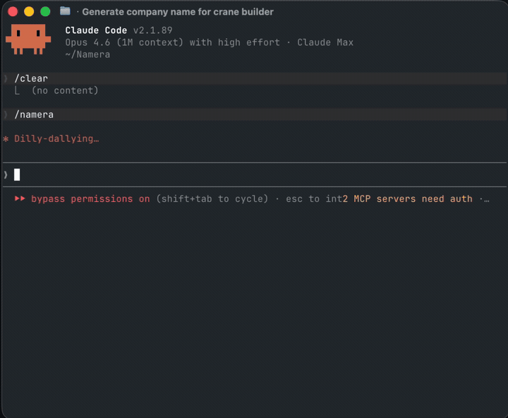

# Namera

Name your startup like a YC founder. Check domain availability, screen for trademark conflicts, and rank everything — so you pick from the best options, not all of them.



## Install

```bash
uvx namera
```

Or install persistently:

```bash
uv tool install namera
```

<details>
<summary>Install from source</summary>

```bash
git clone https://github.com/siddmax/Namera.git
cd Namera
pip install -e .
```

</details>

```bash
uvx namera find --context '{"name_candidates": ["voxly", "dataprime"], "niche": "fintech"}'
```

```
 Ranked results
┌──────┬────────────┬───────┬────────────┬───────────┐
│ Rank │ Name       │ Score │ .com       │ Trademark │
├──────┼────────────┼───────┼────────────┼───────────┤
│  1   │ getnamera  │  92   │ Available  │  Clear    │
│  2   │ trynamera  │  87   │ Available  │  Clear    │
│  3   │ namerahq   │  84   │ Available  │  Clear    │
└──────┴────────────┴───────┴────────────┴───────────┘
```

## Features

- **Domain availability** — DNS, RDAP, and optional pricing lookups
- **Trademark screening** — 12.7M USPTO trademarks, exact + fuzzy matching
- **Social handle checks** — GitHub, Twitter/X, Instagram
- **Name generation** — permutations with prefixes, suffixes, and TLD combinations
- **Weighted ranking** — composite scores from availability, trademark safety, length, and pronounceability
- **Scoring profiles** — built-in presets for fintech, SaaS, consumer, developer tools
- **20 TLD presets** — `popular`, `tech`, `startup`, `fintech`, `geo-us`, `geo-eu`, and more
- **Multiple output formats** — table, JSON, NDJSON, CSV
- **Agent-friendly** — auto-detects piped output and switches to JSON. Designed for Claude Code, Codex, and other AI agents
- **Fast** — concurrent async checks with caching

## Usage

### Check a name

```bash
namera search voxly
namera domain voxly --tlds com,io,ai
namera trademark voxly
namera whois voxly.com
```

### Discover names with business context

```bash
# Interactive wizard
namera find

# Structured input (for agents and scripts)
namera find --context '{"name_candidates": ["voxly", "dataprime"], "description": "fintech analytics platform", "niche": "finance"}'

# Only available names, as JSON
namera find --context '...' --only-available --json
```

### Generate name permutations

```bash
namera compose namera --common-prefixes --common-suffixes --check
namera compose namera --prefix get --prefix try --suffix hq --tlds com,io
```

### Rank candidates

```bash
namera rank voxly dataprime nimbus
namera rank voxly dataprime --profile fintech --json
```

### TLD presets

```bash
# See all presets
namera presets

# Use a preset anywhere TLDs are accepted
namera compose voxly --tlds startup --check
namera domain voxly --tlds tech
```

## MCP Server (for AI agents)

Namera ships as an MCP server so AI agents (Claude Code, ChatGPT, Codex) can call it directly.

```bash
pip install namera[mcp]
namera-mcp
```

Add to Claude Desktop (`~/Library/Application Support/Claude/claude_desktop_config.json`):

```json
{
  "mcpServers": {
    "namera": {
      "command": "namera-mcp",
      "args": []
    }
  }
}
```

Two tools are exposed:

- **`check_name`** — check a single name across domain, trademark, and social
- **`find_names`** — check multiple candidates with business context, score, and rank them

## Scoring Profiles

| Profile | Optimizes for |
|---------|--------------|
| `default` | Balanced — domain, trademark, length, pronounceability |
| `startup-saas` | .com availability (hard filter: must have .com) |
| `fintech` | Trademark safety (hard filter: must be trademark-clear) |
| `consumer` | Social handles + pronounceability |
| `developer-tools` | .dev/.io TLDs + GitHub handle |

<details>
<summary>Development</summary>

```bash
pip install -e ".[dev]"
pytest tests/ -v
ruff check src/ tests/
```

</details>

## License

MIT

<!-- mcp-name: io.github.siddmax/namera -->
